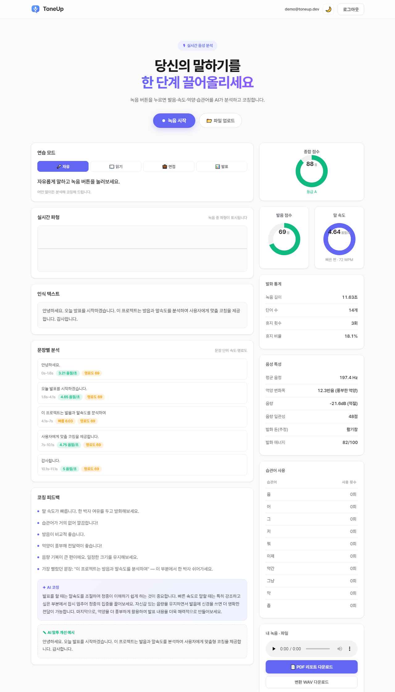
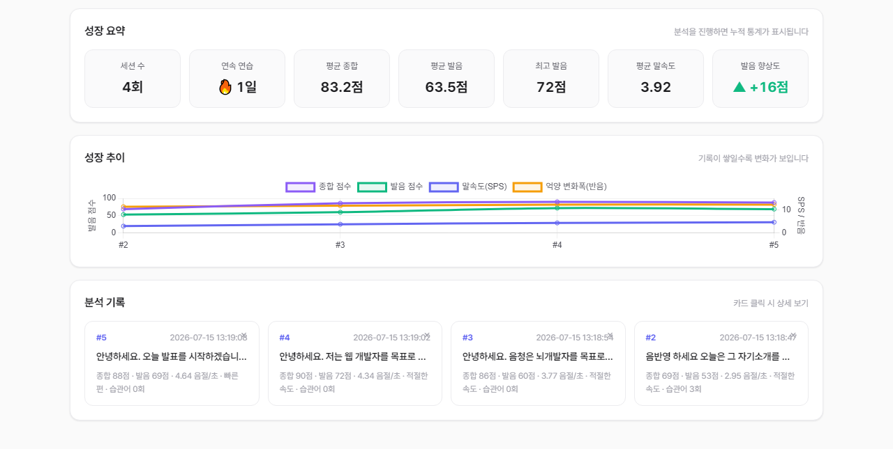
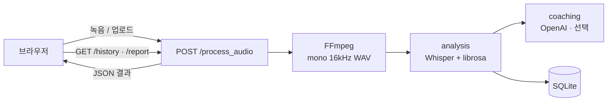
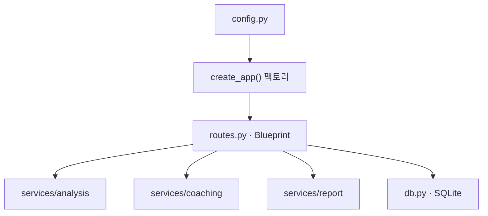

<div align="center">

# 🎙 ToneUp · AI Speech Coach

**한국어 발화를 녹음하면 발음·말속도·억양·음량·습관어·휴지를 AI가 분석하고 코칭하는 웹앱**

녹음 또는 오디오 파일 업로드 → 실시간 분석 → 맞춤 코칭 → 기록 추적 → PDF 리포트


[](https://github.com/CokeIsAlso/ToneUp/actions/workflows/ci.yml)

</div>

> **EN summary —** ToneUp is a Korean speech-coaching web app. Record (or upload) your
> voice and it transcribes with Whisper, analyzes pace, pronunciation, intonation,
> loudness, filler words and pauses with librosa, generates coaching (rule-based +
> optional OpenAI), tracks progress over time, and exports a PDF report.

> 🧑‍💻 **1인 개발 프로젝트** — 기획 · UI/UX · 백엔드 · 음성 분석 · 인증 · 테스트 · 문서까지
> 전 과정을 혼자 설계하고 구현했습니다.

---

## ✨ 주요 기능

| 기능 | 설명 |
|------|------|
| 🎧 실시간 녹음·파형 | 브라우저 마이크 녹음 + 실시간 파형 + 타이머 |
| 📂 파일 업로드 | 오디오 파일 선택·드래그&드롭 분석 |
| 📝 음성 인식 | OpenAI **Whisper** 한국어 STT |
| 🏃 말속도 | 한국어에 맞는 **SPS(음절/초)** + 보조 WPM |
| 🗣 발음 점수 | Whisper segment 신뢰도(avg_logprob) → 0~100 |
| 🏅 종합 점수 | 발음·속도·억양·습관어·휴지 가중 합산 0~100 + 등급(A+~D) |
| 📑 문장별 분석 | Whisper 타임스탬프로 문장 단위 속도·명료도, 가장 흐린/빠른 문장 코칭 |
| 🔊 녹음 다시 듣기 | 분석 결과·기록 상세에서 내 녹음을 바로 재생 |
| 🔥 연습 스트릭 | 연속 연습 일수 추적으로 꾸준함 동기부여 |
| 🎵 음정·억양 | librosa `pyin` F0 → 변화폭(반음)·단조로움 판정 |
| 🔊 음량 | RMS dBFS + 음량 일관성 점수 |
| 🔁 습관어 | 간투사 **토큰 단위 정확 카운트** + 텍스트 하이라이트 |
| ⏸ 휴지 | 무음 구간 검출로 휴지 횟수·비율 |
| 🎭 발화 톤(감정) | 운율(음정·음량·속도) 기반 발화 톤·에너지 추정 |
| 🎯 연습 모드 | **자유 · 읽기 · 면접 · 발표** 4가지 모드, 모드별 프롬프트·코칭 |
| 💼 AI 면접 모드 | 면접 질문 제시 + 답변 내용·전달력 코칭 |
| 📊 발표 연습 모드 | 발표 주제 제시 + 전달력(속도·자신감·군더더기) 코칭 |
| 📖 읽기 연습 | 연습 문장 제시 + **정확도(%)** + 틀리게 읽은 단어 하이라이트 |
| ✎ AI 말투 개선 | 습관어를 다듬은 **개선 표현 예시** 생성 |
| 🤖 AI 코칭 | OpenAI 맞춤 코칭 (키 없으면 규칙 기반 폴백) |
| 🔐 회원가입·로그인 | 세션 인증(비밀번호 해시) — 기록·통계를 **개인별로 분리** |
| 📈 성장 추이·요약 | 개인별 Chart.js 추세 + 세션·평균/최고 발음·향상도 요약 |
| 🗂 기록 | SQLite 저장·상세 모달·삭제 (본인 것만) |
| 📄 PDF 리포트 | 한글 폰트 PDF 다운로드 |
| 🌙 다크 모드 | 테마 토글(선호 저장) |

---

## 🖼 스크린샷

| 메인 / 분석 결과 | 성장 추이 / 기록 |
|---|---|
|  |  |

---

## 🏗 아키텍처

### 요청 흐름



### 계층 구조 (app factory + blueprint)



- **웹 계층**(`routes.py`)은 HTTP만 담당하고, **도메인 로직**은 `services/`로 분리
- 설정은 `config.py` 한 곳에서 환경변수로 주입 → 테스트/운영 동일 코드
- `create_app()` 팩토리로 **테스트 시 임시 DB 설정을 주입**해 격리 테스트 가능

---

## 📁 프로젝트 구조

```
ToneUp/
├── app.py                  # 개발 실행 진입점 (create_app 사용)
├── wsgi.py                 # 운영 WSGI 진입점 (gunicorn/waitress)
├── toneup/                 # 애플리케이션 패키지
│   ├── __init__.py         # create_app() 앱 팩토리
│   ├── config.py           # 중앙 설정 (환경변수)
│   ├── routes.py           # HTTP 라우트 (Blueprint, 로그인 보호)
│   ├── auth.py             # 회원가입·로그인·세션 + login_required
│   ├── db.py               # SQLite 데이터 계층(+users) + 자동 마이그레이션
│   └── services/
│       ├── analysis.py     # Whisper + librosa 분석 (지연 로딩·스레드 락)
│       ├── coaching.py     # OpenAI AI 코칭 (폴백)
│       └── report.py       # PDF 리포트 (한글 폰트)
├── templates/
│   ├── index.html          # 메인 페이지
│   └── login.html          # 로그인 / 회원가입
├── static/
│   ├── css/style.css       # 클린 라이트 미니멀 + 다크 테마
│   ├── js/app.js           # 녹음·업로드·결과·히스토리·차트·모달
│   └── js/visualizer.js    # 실시간 파형
├── tests/                  # pytest (분석·DB·리포트·앱 통합)
├── docs/screenshots/       # 스크린샷
├── requirements.txt
└── README.md
```

---

## 🛠 기술 선택 이유

| 선택 | 이유 |
|------|------|
| **Whisper** | 사전학습 한국어 STT 품질이 우수하고 로컬 실행 가능(키 불필요), segment 신뢰도로 발음 점수까지 산출 |
| **librosa** | F0(pyin)·RMS·무음 분할 등 음성 특징 추출을 한 라이브러리로 처리 |
| **SPS(음절/초)** | 영어식 WPM은 한국어 띄어쓰기 특성상 왜곡 → 음절 기반이 한국어 발화 속도에 적합 |
| **Flask app factory + Blueprint** | 설정 주입·테스트 격리·확장성을 위한 표준 패턴 |
| **SQLite** | 별도 서버 없이 기록 영속화, 컬럼 정의 기반 자동 마이그레이션 |
| **OpenAI(선택) + 규칙 폴백** | 키가 없거나 실패해도 앱이 항상 동작하도록 graceful degradation |

---

## 🚀 설치 및 실행

### 1. 의존성

```bash
# (선택) PyTorch CPU 버전 먼저
pip install torch --index-url https://download.pytorch.org/whl/cpu
pip install -r requirements.txt
```

### 2. FFmpeg (필수)

[gyan.dev/ffmpeg/builds](https://www.gyan.dev/ffmpeg/builds/)에서 essentials 빌드를 받아
`C:\ffmpeg\bin`을 PATH에 추가하거나, `FFMPEG_BIN` 환경변수로 경로를 지정합니다.
확인: `ffmpeg -version`

### 3. (선택) AI 코칭 키

`.env.example`을 `.env`로 복사하고 `OPENAI_API_KEY`를 채웁니다. 없으면 규칙 기반으로 동작.

### 4. 실행

```bash
# 개발 모드
set FLASK_DEBUG=1 && python app.py
# 운영 모드 (waitress 자동)
python app.py
# 또는 WSGI 서버로
waitress-serve --port=5000 wsgi:app
```

→ http://127.0.0.1:5000

### 5. 테스트

```bash
pytest          # 37개 테스트 (분석·DB·PDF·인증·레이트리밋·앱 통합)
```

---

## ⚙️ 환경변수

| 변수 | 설명 | 기본값 |
|------|------|--------|
| `OPENAI_API_KEY` | 설정 시 AI 코칭 활성화 | (없음 → 규칙 기반) |
| `OPENAI_MODEL` | AI 코칭 모델 | `gpt-4o-mini` |
| `FLASK_DEBUG` | `1`이면 개발 모드 | `0` |
| `TONEUP_SECRET_KEY` | 세션 서명 키 **(배포 시 필수 변경)** | dev 기본값 |
| `HOST` / `PORT` | 바인딩 | `127.0.0.1` / `5000` |
| `TONEUP_WHISPER_MODEL` | Whisper 크기 | `base` |
| `TONEUP_DB` | SQLite 경로 | `<root>/toneup.db` |
| `TONEUP_MAX_UPLOAD_MB` | 업로드 최대 MB | `25` |
| `TONEUP_WAV_TTL_HOURS` | WAV 보관 시간(0=영구) | `24` |
| `TONEUP_LOG_LEVEL` | 로그 레벨 | `INFO` |
| `FFMPEG_BIN` | ffmpeg 경로 | `ffmpeg` |
| `TONEUP_FFMPEG_TIMEOUT` | ffmpeg 변환 제한 시간(초) | `120` |
| `TONEUP_PDF_FONT` | PDF 한글 TTF 경로 | 맑은 고딕 |

---

## 🔌 API

> `/`, `/process_audio`, `/history*`, `/stats`, `/report/*` 는 **로그인 필요**.

| 메서드 | 경로 | 설명 |
|--------|------|------|
| `GET` | `/login` | 로그인 / 회원가입 페이지 |
| `POST` | `/api/signup` · `/api/login` · `/api/logout` | 인증 |
| `GET` | `/api/me` | 로그인 상태 조회 |
| `GET` | `/` | 메인 페이지 (미로그인 시 `/login` 리다이렉트) |
| `POST` | `/process_audio` | 오디오 업로드 → 분석 결과(JSON) |
| `GET` | `/history` | 최근 기록 목록 |
| `GET` / `DELETE` | `/history/<id>` | 기록 상세 / 삭제 |
| `GET` | `/stats` | 성장 요약 통계(세션·평균/최고 발음·향상도) |
| `GET` | `/report/<id>` | PDF 리포트 |
| `GET` | `/uploads/<file>` | 변환 WAV 다운로드 |
| `GET` | `/audio/<file>` | 녹음 인라인 재생(다시 듣기) |

---

## 🧩 엔지니어링 포인트

- **세션 기반 인증**(werkzeug 비밀번호 해시) + `login_required` 보호 + **기록/통계 user별 스코프**
- **로그인 브루트포스 방지**: IP+이메일별 실패 5회/5분 초과 시 429로 잠시 차단
- **보안 헤더 + 세션 쿠키 옵션**: `nosniff`/`X-Frame-Options`/`Referrer-Policy`, `HttpOnly`·`SameSite=Lax`
- **앱 팩토리 + 블루프린트**로 웹/도메인/설정 계층 분리, 테스트에 임시 설정 주입
- **Whisper 지연 로딩 + 스레드 락 + 배열 직접 입력**: 최초 요청에만 로드, 락으로 직렬화,
  librosa로 로드한 16kHz 배열을 그대로 전사해 **이중 디코딩 제거**(Whisper 내부 ffmpeg 불필요)
- **컬럼 정의 기반 자동 마이그레이션 + user_id 인덱스**, SQLite 커넥션은 트랜잭션 후 반드시 close
- **Graceful degradation**: OpenAI/폰트/ffmpeg 부재·변환 시간 초과·용량 초과에도 JSON 에러로 친절히 응답
- **logging** 기반 구조적 로그, 환경변수 중앙화(`config.py`), 배포 시 기본 SECRET_KEY 사용 경고
- **문장별 구간 분석**: Whisper 타임스탬프 재활용으로 추가 연산 없이 문장 단위 속도·명료도 산출
- **37개 pytest** (신호처리·DB·PDF·인증·레이트리밋·스트릭·앱 통합) — Whisper 미적재 상태로 빠르게 실행

---

## 📝 크레딧
Whisper(OpenAI), librosa, Flask, Chart.js, Pretendard, reportlab 등 오픈소스를 사용합니다.
